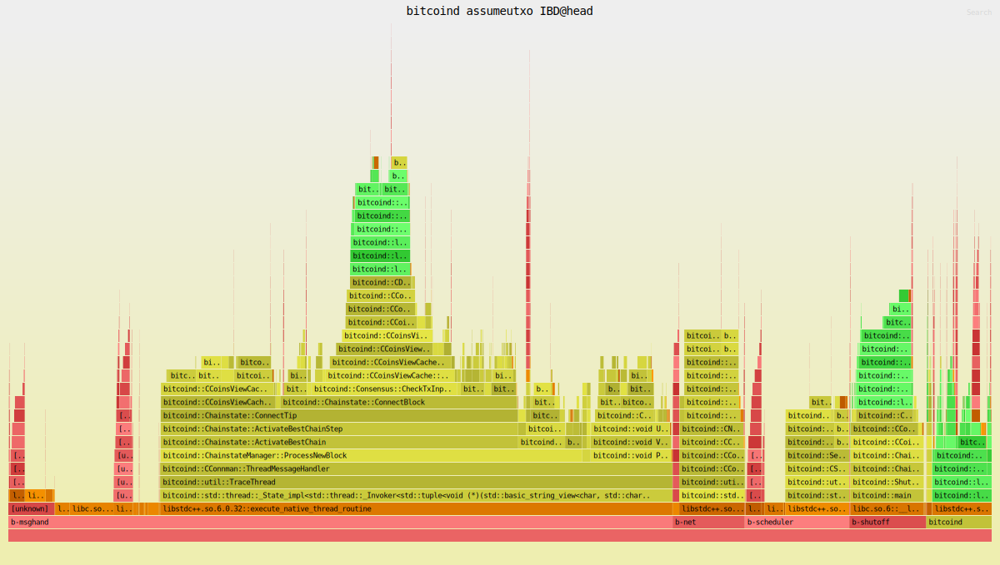

# benchcoin

A Bitcoin Core benchmarking fork with automated IBD performance tracking.

## Overview

This repository is a fork of Bitcoin Core that performs automated IBD (Initial Block Download) benchmarking. It measures and compares the performance impact of changes to Bitcoin Core's codebase using reproducible, long-running benchmarks.

**Live Results:** [bitcoin-dev-tools.github.io/benchcoin](https://bitcoin-dev-tools.github.io/benchcoin)

## Features

- **Nightly Benchmarks** - Daily performance tracking of master branch
- **PR Benchmarks** - Automated comparison of base vs head on pull requests
- **Multiple Configurations:**
  - Default cache (450 MB dbcache)
  - Large cache (32 GB dbcache)
  - Instrumented mode (flamegraphs + debug logging)
- **Performance Visualizations:**
  - Interactive Plotly charts for nightly trends
  - CPU flamegraphs with Bitcoin-specific coloring
  - Time series plots (block height, cache size, tx count, LevelDB metrics)
- **Reproducible Configs** - TOML config files capture all benchmark parameters

## Example Flamegraph



## How to Use

### Benchmark a PR

1. Open a Pull Request against **this repo** (not bitcoin/bitcoin)
2. Wait for the benchmark workflow to complete
3. Results are posted as a PR comment with link to detailed report

### Benchmark an Existing bitcoin/bitcoin PR

```bash
# Requires 'just' (https://github.com/casey/just)
just pick-pr <number>   # Cherry-pick commits from bitcoin/bitcoin PR
git push origin HEAD
# Open PR against this repo
```

## Benchmark Configurations

All benchmark parameters are defined in config files at `bench/configs/`:

| Config | Matrix Entries | Runs | Use Case |
|--------|---------------|------|----------|
| `nightly.toml` | 450, 32000 | 2 | Nightly tracking |
| `pr.toml` | 450-false, 450-true, 32000-false, 32000-true | 3 | PR comparison |

Matrix entries are generated from `[bitcoind.matrix]` values (e.g., `dbcache = [450, 32000]`).
Both configs benchmark blocks 840,000 → 855,000 from a dedicated sync peer.

## Benchmark Outputs

### Nightly (Homepage)

- Interactive chart showing sync time trends over time
- Machine specs and config stored with results
- Accessible at the repository's GitHub Pages root

### PR Reports

- Timing comparison (mean, stddev, speedup %)
- CPU flamegraphs (instrumented mode)
- Performance plots (instrumented mode)
- Accessible at `/results/pr-N/run-id/`

## Local Development

### Prerequisites

- [Nix](https://nixos.org/download/) with flakes enabled
- Blockchain datadir snapshot (pruned at block 840,000)

### Quick Start

```bash
# Enter nix environment
nix develop

# Build binaries
python3 bench.py build HEAD~1:base HEAD:head

# Run benchmark with config
python3 bench.py run \
    --benchmark-config bench/configs/pr.toml \
    --matrix-entry 450-false \
    --datadir /path/to/pruned-840k \
    base:./binaries/base/bitcoind \
    head:./binaries/head/bitcoind
```

### Just Recipes

```bash
just test-uninstrumented HEAD~1 HEAD /path/to/datadir  # Quick smoke test
just test-instrumented HEAD~1 HEAD /path/to/datadir    # With flamegraphs
just build HEAD~1:base HEAD:head                        # Build only
just pick-pr 12345                                      # Cherry-pick PR
```

## Technical Details

### Tools

- [Hyperfine](https://github.com/sharkdp/hyperfine) - Benchmark timing
- [Flamegraph](https://github.com/willcl-ark/flamegraph) - CPU profiling (Bitcoin fork with custom palette)
- [Plotly.js](https://plotly.com/javascript/) - Interactive charts
- [matplotlib](https://matplotlib.org/) - Performance plots

### CI Infrastructure

**Runner:** Self-hosted on Hetzner AX52 (16 cores, NixOS)
- 1 core for system
- 1 core for perf/flamegraph
- 14 cores for bitcoind

**Sync Peer:** Dedicated Hetzner VPS serving blocks over network to exercise full IBD codepaths.

Configuration repos:
- Runner: [nix-github-runner](https://github.com/bitcoin-dev-tools/nix-github-runner)
- Seed: [nix-seed-node](https://github.com/bitcoin-dev-tools/nix-seed-node)

### Workflow Overview

```
Daily 5:00 AM GMT
       │
       ▼
   rebase.yml (rebase on upstream)
       │
       ▼
 nightly-benchmark.yml
       │
       ├─► Build master
       ├─► Benchmark (default + large configs)
       ├─► Append to nightly-history.json
       └─► Generate homepage chart

PR opened
       │
       ▼
   benchmark.yml
       │
       ├─► Build base + head
       └─► Benchmark (4 matrix configs)
               │
               ▼
       publish-results.yml
               │
               ├─► Generate HTML report
               ├─► Commit to gh-pages
               └─► Post PR comment
```

### Results Storage

Results are stored on the `gh-pages` branch:

```
/
├── index.html              # Nightly chart (homepage)
├── nightly-history.json    # Historical data + machine specs + config
└── results/
    ├── index.html          # PR results index
    └── pr-<N>/<run-id>/    # Individual PR reports
```

The `nightly-history.json` captures:
- Benchmark config (heights, peer, dbcache values, command template)
- Machine specs (CPU, cores, RAM, disk type, kernel)
- Results (date, commit, mean, stddev, runs)

## License

This project is licensed under the same terms as Bitcoin Core - see the [COPYING](../COPYING) file for details.
